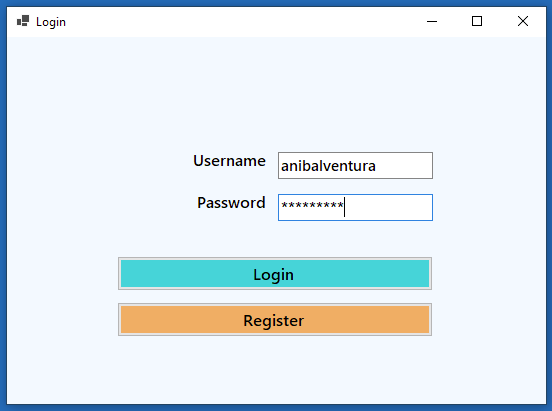
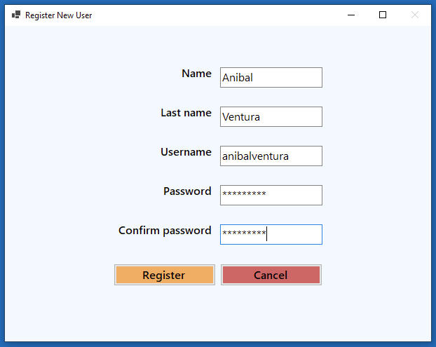
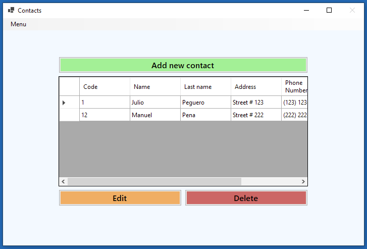
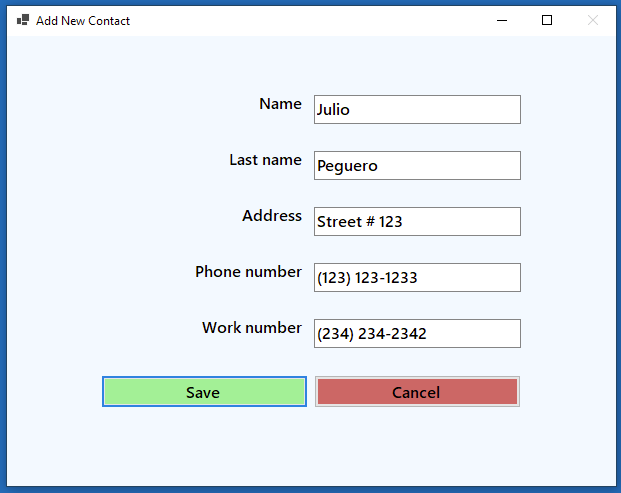
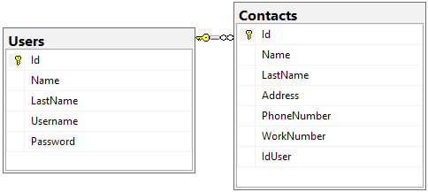

# Contacts Agenda

[](https://dotnet.microsoft.com)
[](https://dotnet.microsoft.com)
[](LICENCE.md)

<p align="center">
  
  
  
  
</p>

WinForm app to manage a contacts agenda by user, written in .NET Core with SQL-Server using OOP.

## Features

- Data persistence with SQL Server.
- Login with username and password.
  - Verify in the database if the data entered is correct.
- Create new users to login.
  - Check if username exists.
  - Check if passwords match.
  - Check if all the data has been completed.
- Shows contact list only of the user who created it.
- Create, edit and delete contacts.
  - Check if all the data has been completed.
- Option in menu strip to logout.

## Database Diagram

<p align="left">
  
</p>

## Dependencies

- [System.Data.SqlClient - Version 4.8.3](https://www.nuget.org/packages/System.Data.SqlClient)

## Build

1. Open and run the following SQL script file `../Database/ContactsAgendaDB.sql` to generate the database structure used in this project.

2. In the file `../ContactAgenda/App.config` find this line and change `source` parameter:

```xml
connectionString="data source=<SQL SERVER NAME>;initial catalog=ContactsAgenda;integrated security=True;"
```

## License

```xml
MIT License

Copyright (c) 2021 Anibal Ventura
```
